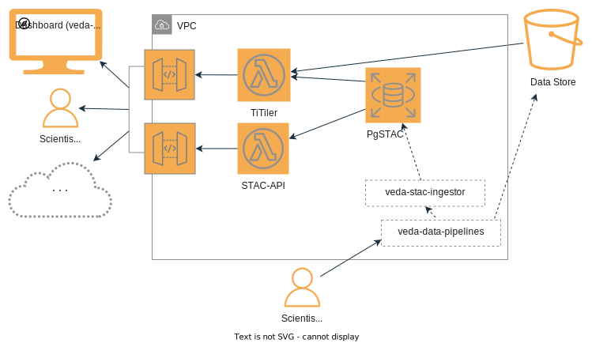

# veda-backend
This project deploys a complete backend for a [SpatioTemporal Asset Catalog](https://stacspec.org/) including a postgres database, a metadata API, and raster tiling API. Veda-backend is a non-forked version of the [eoAPI](https://github.com/developmentseed/eoAPI) demo project. Veda-backend is decoupled from the demo project to selectively incorporate new stable functionality from the fast moving development in eoAPI while providing a continuous baseline for veda-backend users and to support project specific business and deployment logic.

The primary tools employed in the [eoAPI demo](https://github.com/developmentseed/eoAPI) and this project are:
- [stac-spec](https://github.com/radiantearth/stac-spec)
- [stac-api-spec](https://github.com/radiantearth/stac-api-spec)
- [stac-fastapi](https://github.com/stac-utils/stac-fastapi)
- [pgstac](https://github.com/stac-utils/pgstac)
- [titiler](https://github.com/developmentseed/titiler)
- [titiler-pgstac](https://github.com/stac-utils/titiler-pgstac)

## VEDA backend context


Veda backend is is the central index of the [VEDA ecosystem](#veda-ecosystem). This project provides the infrastructure for a PgSTAC database, STAC API, and TiTiler. This infrastructure is used to discover, access, and visualize the Analysis Ready Cloud Optimized (ARCO) assets of the VEDA Data Store.

## Deployment

This project uses an AWS CDK [CloudFormation](https://docs.aws.amazon.com/AWSCloudFormation/latest/UserGuide/Welcome.html) stack to deploy a full AWS virtual private cloud environment with a database and supporting lambda function APIs. The deployment constructs, database, and API services are highly configurable. This section provices basic deployment instructions as well as support for customization.

### Tooling & supporting documentation

- [CDK Documentation](https://docs.aws.amazon.com/cdk/v2/guide/getting_started.html)
- [AWS CLI](https://docs.aws.amazon.com/cli/latest/userguide/cli-chap-getting-started.html)

### Enviroment variables

An [.example.env](.example.env) template is supplied for for local deployments. If updating an existing deployment, it is essential to check the most current values for these variables by fetching these values from AWS Secrets Manager. The environment secrets are named `<app-name>-<stage>-env`, for example `veda-backend-dev-env`.
> **Warning** The environment variables stored as AWS secrets are manually maintained and should be reviewed before deploying updates to existing stacks.

### Fetch environment variables using AWS CLI

To retrieve the variables for a stage that has been previously deployed, the secrets manager can be used to quickly populate an .env file with [scripts/sync-env-local.sh](scripts/sync-env-local.sh). 

```
./scripts/sync-env-local.sh <app-secret-name>
```
### Basic environment variables
| Name | Explanation |
| --- | --- |
| `APP_NAME` | Optional app name used to name stack and resources, defaults to `veda-backend` |
| `STAGE` | **REQUIRED** Deployment stage used to name stack and resources, i.e. `dev`, `staging`, `prod` |
| `VEDA_DB_PGSTAC_VERSION` | **REQUIRED** version of PgStac database, i.e. 0.7.9 |
| `VEDA_DB_SCHEMA_VERSION` | **REQUIRED** The version of the custom veda-backend schema, i.e. 0.1.1 |
| `VEDA_DB_SNAPSHOT_ID` | **Once used always REQUIRED** Optional RDS snapshot identifier to initialize RDS from a snapshot |
> **Note** See [Advanced Configuration](docs/advanced_configuration.md) for details about custom configuration options.

### Deploying to the cloud

#### Install pre-requisites

```bash
nvm install 17
nvm use 17
node --version
npm install --location=global aws-cdk
python3 -m pip install --upgrade pip
python3 -m pip install -e ".[dev,deploy,test]"
```

#### Run the deployment

```
# Review what infrastructure changes your deployment will cause
cdk diff
# Execute deployment and standby--security changes will require approval for deployment
cdk deploy
```
  
## Deleting the CloudFormation stack

If this is a development stack that is safe to delete, you can delete the stack in CloudFormation console or via `cdk destroy`, however, the additional manual steps were required to completely delete the stack resources:

1. You will need to disable deletion protection of the RDS database and delete the database.
2. Detach the Internet Gateway (IGW) from the VPC and delete it.
3. If this stack created a new VPC, delete the VPC (this should delete a subnet and security group too).

## Custom deployments

The default settings for this project generate a complete AWS environment including a VPC and gateways for the stack. See this guidance for adjusting the veda-backend stack for existing managed and/or shared AWS environments.
- [Deploy to an existing managed AWS environment](docs/deploying_to_existing_environments.md)
- [Creating a shared base VPC and AWS environment](docs/deploying_to_existing_environments.md#optional-deploy-standalone-base-infrastructure)

## Local Docker deployment

Start up a local stack
```
docker compose up
```
Clean up after running locally
```
docker compose down
```

# Operations

## Adding new data to veda-backend 

> **Warning** PgSTAC records should be loaded in the database using [pypgstac](https://github.com/stac-utils/pgstac#pypgstac) for proper indexing and partitioning.

The VEDA ecosystem includes tools specifially created for loading PgSTAC records and optimizing data assets. The [veda-data-pipelines](https://github.com/NASA-IMPACT/veda-data-pipelines) project provides examples of cloud pipelines that transform data to cloud optimized formats, generate STAC metadata, and submit records for publication to the veda-backend database using the [veda-stac-ingestor](https://github.com/NASA-IMPACT/veda-stac-ingestor).

## Support scripts
Support scripts are provided for manual system operations.
- [Rotate pgstac password](support_scripts/README.md#rotate-pgstac-password)

# VEDA ecosystem

## Projects
| Name | Explanation |
| --- | --- |
| **veda-backend** | Central index (database) and APIs for recording, discovering, viewing, and using VEDA assets |
| [**veda-config**](https://github.com/NASA-IMPACT/veda-config) | Configuration for viewing VEDA assets in dashboard UI  |
| [**veda-ui**](https://github.com/NASA-IMPACT/veda-ui) | Dashboard UI for viewing and analysing VEDA assets |
| [**veda-stac-ingestor**](https://github.com/NASA-IMPACT/veda-stac-ingestor) |  Entry-point for users/services to add new records to database |
| [**veda-data-pipelines**](https://github.com/NASA-IMPACT/veda-data-pipelines) | Cloud optimize data assets and submit records for publication to veda-stac-ingestor |
| [**veda-docs**](https://github.com/NASA-IMPACT/veda-docs) | Documentation repository for end users of VEDA ecosystem data and tools |

## VEDA usage examples

### [VEDA documentation](https://nasa-impact.github.io/veda-docs)

### [VEDA dashboard](https://www.earthdata.nasa.gov/dashboard)

# STAC community resources

## STAC browser
Radiant Earth's [stac-browser](https://github.com/radiantearth/stac-browser) is a browser for STAC catalogs. The demo version of this browser [radiantearth.github.io/stac-browser](https://radiantearth.github.io/stac-browser/#/) can be used to browse the contents of the veda-backend STAC catalog, paste the veda-backend stac-api URL deployed by this project in the demo and click load. Read more about the recent developments and usage of stac-browser [here](https://medium.com/radiant-earth-insights/the-exciting-future-of-the-stac-browser-2351143aa24b).

# License
This project is licensed under **Apache 2**, see the [LICENSE](LICENSE) file for more details.
