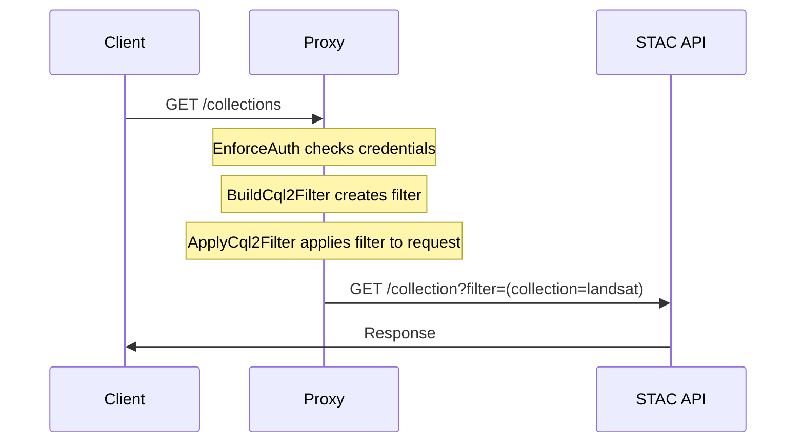

<div align="center">
  <h1 style="font-family: monospace">stac auth proxy</h1>
  <p align="center">Reverse proxy to apply auth*n to your STAC API.</p>
</div>

---

STAC Auth Proxy is a proxy API that mediates between the client and your internally accessible STAC API to provide flexible authentication, authorization, and content-filtering mechanisms.

> [!IMPORTANT] 
> **We would :heart: to hear from you!**
> Please [join the discussion](https://github.com/developmentseed/eoAPI/discussions/209) and let us know how you're using eoAPI! This helps us improve the project for you and others.
> If you prefer to remain anonymous, you can email us at eoapi@developmentseed.org, and we'll be happy to post a summary on your behalf.

## ✨Features✨

- **🔐 Authentication:** Apply [OpenID Connect (OIDC)](https://openid.net/developers/how-connect-works/) token validation and optional scope checks to specified endpoints and methods
- **🛂 Content Filtering:** Use CQL2 filters via the [Filter Extension](https://github.com/stac-api-extensions/filter?tab=readme-ov-file) to tailor API responses based on request context (e.g. user role)
- **🤝 External Policy Integration:** Integrate with external systems (e.g. [Open Policy Agent (OPA)](https://www.openpolicyagent.org/)) to generate CQL2 filters dynamically from policy decisions
- **🧩 Authentication Extension:** Add the [Authentication Extension](https://github.com/stac-extensions/authentication) to API responses to expose auth-related metadata
- **📘 OpenAPI Augmentation:** Enhance the [OpenAPI spec](https://swagger.io/specification/) with security details to keep auto-generated docs and UIs (e.g., [Swagger UI](https://swagger.io/tools/swagger-ui/)) accurate
- **🗜️ Response Compression:** Optimize response sizes using [`starlette-cramjam`](https://github.com/developmentseed/starlette-cramjam/)

## Usage

### Running

The simplest way to run the project is by invoking the application via Docker:

```sh
docker run \
  -it --rm \
  -p 8000:8000 \
  -e UPSTREAM_URL=https://my-stac-api \
  -e OIDC_DISCOVERY_URL=https://my-auth-server/.well-known/openid-configuration \
  ghcr.io/developmentseed/stac-auth-proxy:latest
```

Alternatively, the module can be invoked directly or the application's factory can be passed to Uvicorn:

```sh
python -m stac_auth_proxy
```

```sh
uvicorn --factory stac_auth_proxy:create_app
```

### Installation

For local development, we use [`uv`](https://docs.astral.sh/uv/) to manage project dependencies and environment.

```sh
uv sync
```

Otherwise, the application can be installed as a standard Python module:

```sh
pip install -e .
```

> [!NOTE]
> This project will be available on PyPi in the near future[^30].

### Configuration

The application is configurable via environment variables.

- Core
  - **`UPSTREAM_URL`**, STAC API URL
    - **Type:** HTTP(S) URL
    - **Required:** Yes
    - **Example:** `https://your-stac-api.com/stac`
  - **`WAIT_FOR_UPSTREAM`**, wait for upstream API to become available before starting proxy
    - **Type:** boolean
    - **Required:** No, defaults to `true`
    - **Example:** `false`, `1`, `True`
  - **`CHECK_CONFORMANCE`**, ensure upstream API conforms to required conformance classes before starting proxy
    - **Type:** boolean
    - **Required:** No, defaults to `true`
    - **Example:** `false`, `1`, `True`
  - **`ENABLE_COMPRESSION`**, enable response compression
    - **Type:** boolean
    - **Required:** No, defaults to `true`
    - **Example:** `false`, `1`, `True`
  - **`HEALTHZ_PREFIX`**, path prefix for health check endpoints
    - **Type:** string
    - **Required:** No, defaults to `/healthz`
    - **Example:** `''` (disabled)
  - **`OVERRIDE_HOST`**, override the host header for the upstream API
    - **Type:** boolean
    - **Required:** No, defaults to `true`
    - **Example:** `false`, `1`, `True`
  - **`ROOT_PATH`**, path prefix for the proxy API
    - **Type:** string
    - **Required:** No, defaults to `''` (root path)
    - **Example:** `/api/v1`
    - **Note:** This is independent of the upstream API's path. The proxy will handle removing this prefix from incoming requests and adding it to outgoing links.
- Authentication
  - **`OIDC_DISCOVERY_URL`**, OpenID Connect discovery document URL
    - **Type:** HTTP(S) URL
    - **Required:** Yes
    - **Example:** `https://auth.example.com/.well-known/openid-configuration`
  - **`OIDC_DISCOVERY_INTERNAL_URL`**, internal network OpenID Connect discovery document URL
    - **Type:** HTTP(S) URL
    - **Required:** No, defaults to the value of `OIDC_DISCOVERY_URL`
    - **Example:** `http://auth/.well-known/openid-configuration`
  - **`DEFAULT_PUBLIC`**, default access policy for endpoints
    - **Type:** boolean
    - **Required:** No, defaults to `false`
    - **Example:** `false`, `1`, `True`
  - **`PRIVATE_ENDPOINTS`**, endpoints explicitly marked as requiring authentication and possibly scopes
    - **Type:** JSON object mapping regex patterns to HTTP methods OR tuples of an HTTP method and string representing required scopes
    - **Required:** No, defaults to the following:
      ```json
      {
        "^/collections$": ["POST"],
        "^/collections/([^/]+)$": ["PUT", "PATCH", "DELETE"],
        "^/collections/([^/]+)/items$": ["POST"],
        "^/collections/([^/]+)/items/([^/]+)$": ["PUT", "PATCH", "DELETE"],
        "^/collections/([^/]+)/bulk_items$": ["POST"]
      }
      ```
  - **`PUBLIC_ENDPOINTS`**, endpoints explicitly marked as not requiring authentication, used when `DEFAULT_PUBLIC == False`
    - **Type:** JSON object mapping regex patterns to HTTP methods
    - **Required:** No, defaults to the following:
      ```json
      {
        "^/api.html$": ["GET"],
        "^/api$": ["GET"],
        "^/docs/oauth2-redirect": ["GET"],
        "^/healthz": ["GET"]
      }
      ```
  - **`ENABLE_AUTHENTICATION_EXTENSION`**, enable authentication extension in STAC API responses
    - **Type:** boolean
    - **Required:** No, defaults to `true`
    - **Example:** `false`, `1`, `True`
- OpenAPI / Swagger UI
  - **`OPENAPI_SPEC_ENDPOINT`**, path of OpenAPI specification, used for augmenting spec response with auth configuration
    - **Type:** string or null
    - **Required:** No, defaults to `null` (disabled)
    - **Example:** `/api`
  - **`OPENAPI_AUTH_SCHEME_NAME`**, name of the auth scheme to use in the OpenAPI spec
    - **Type:** string
    - **Required:** No, defaults to `oidcAuth`
    - **Example:** `jwtAuth`
  - **`OPENAPI_AUTH_SCHEME_OVERRIDE`**, override for the auth scheme in the OpenAPI spec
    - **Type:** JSON object
    - **Required:** No, defaults to `null` (disabled)
    - **Example:** `{"type": "http", "scheme": "bearer", "bearerFormat": "JWT", "description": "Paste your raw JWT here. This API uses Bearer token authorization.\n"}`
  - **`SWAGGER_UI_ENDPOINT`**, path of Swagger UI, used to indicate that a custom Swagger UI should be hosted, typically useful when providing accompanying `SWAGGER_UI_INIT_OAUTH` arguments
    - **Type:** string or null
    - **Required:** No, defaults to `null` (disabled)
    - **Example:** `/api.html`
  - **`SWAGGER_UI_INIT_OAUTH`**, initialization options for the [Swagger UI OAuth2 configuration](https://swagger.io/docs/open-source-tools/swagger-ui/usage/oauth2/) on custom Swagger UI
    - **Type:** JSON object
    - **Required:** No, defaults to `null` (disabled)
    - **Example:** `{"clientId": "stac-auth-proxy", "usePkceWithAuthorizationCodeGrant": true}`
- Filtering
  - **`ITEMS_FILTER_CLS`**, CQL2 expression generator for item-level filtering
    - **Type:** JSON object with class configuration
    - **Required:** No, defaults to `null` (disabled)
    - **Example:** `stac_auth_proxy.filters:Opa`, `stac_auth_proxy.filters:Template`, `my_package:OrganizationFilter`
  - **`ITEMS_FILTER_ARGS`**, Positional arguments for CQL2 expression generator
    - **Type:** List of positional arguments used to initialize the class
    - **Required:** No, defaults to `[]`
    - **Example:**: `["org1"]`
  - **`ITEMS_FILTER_KWARGS`**, Keyword arguments for CQL2 expression generator
    - **Type:** Dictionary of keyword arguments used to initialize the class
    - **Required:** No, defaults to `{}`
    - **Example:** `{"field_name": "properties.organization"}`
  - **`COLLECTIONS_FILTER_CLS`**, CQL2 expression generator for collection-level filtering
    - **Type:** JSON object with class configuration
    - **Required:** No, defaults to `null` (disabled)
    - **Example:** `stac_auth_proxy.filters:Opa`, `stac_auth_proxy.filters:Template`, `my_package:OrganizationFilter`
  - **`COLLECTIONS_FILTER_ARGS`**, Positional arguments for CQL2 expression generator
    - **Type:** List of positional arguments used to initialize the class
    - **Required:** No, defaults to `[]`
    - **Example:**: `["org1"]`
  - **`COLLECTIONS_FILTER_KWARGS`**, Keyword arguments for CQL2 expression generator
    - **Type:** Dictionary of keyword arguments used to initialize the class
    - **Required:** No, defaults to `{}`
    - **Example:** `{"field_name": "properties.organization"}`

### Tips

#### Root Paths

The proxy can be optionally served from a non-root path (e.g., `/api/v1`). Additionally, the proxy can optionally proxy requests to an upstream API served from a non-root path (e.g., `/stac`). To handle this, the proxy will:

- Remove the `ROOT_PATH` from incoming requests before forwarding to the upstream API
- Remove the proxy's prefix from all links in STAC API responses
- Add the `ROOT_PATH` prefix to all links in STAC API responses
- Update the OpenAPI specification to include the `ROOT_PATH` in the servers field
- Handle requests that don't match the `ROOT_PATH` with a 404 response

#### Non-OIDC Workaround

If the upstream server utilizes RS256 JWTs but does not utilize a proper OIDC server, the proxy can be configured to work around this by setting the `OIDC_DISCOVERY_URL` to a statically-hosted OIDC discovery document that points to a valid JWKS endpoint. Additionally, the OpenAPI can be configured to support direct JWT input, via:

```sh
OPENAPI_AUTH_SCHEME_NAME=jwtAuth
OPENAPI_AUTH_SCHEME_OVERRIDE={"type": "http", "scheme": "bearer", "bearerFormat": "JWT", "description": "Paste your raw JWT here. This API uses Bearer token authorization."}
```

### Customization

While the project is designed to work out-of-the-box as an application, it might not address every projects needs. When the need for customization arises, the codebase can instead be treated as a library of components that can be used to augment any [ASGI](https://asgi.readthedocs.io/en/latest/)-compliant webserver (e.g. [Django](https://docs.djangoproject.com/en/3.0/topics/async/), [Falcon](https://falconframework.org/), [FastAPI](https://github.com/tiangolo/fastapi), [Litestar](https://litestar.dev/), [Responder](https://responder.readthedocs.io/en/latest/), [Sanic](https://sanic.dev/), [Starlette](https://www.starlette.io/)). Review [`app.py`](https://github.com/developmentseed/stac-auth-proxy/blob/main/src/stac_auth_proxy/app.py) to get a sense of how we make use of the various components to construct a FastAPI application.

## Architecture

### Middleware Stack

The majority of the proxy's functionality occurs within a chain of middlewares. Each request passes through this chain, wherein each middleware performs a specific task:

1. **`EnforceAuthMiddleware`**

   - Handles authentication and authorization
   - Configurable public/private endpoints
   - OIDC integration
   - Places auth token payload in request state

2. **`BuildCql2FilterMiddleware`**

   - Builds CQL2 filters based on request context/state
   - Places [CQL2 expression](http://developmentseed.org/cql2-rs/latest/python/#cql2.Expr) in request state

3. **`ApplyCql2FilterMiddleware`**

   - Retrieves [CQL2 expression](http://developmentseed.org/cql2-rs/latest/python/#cql2.Expr) from request state
   - Augments request with CQL2 filter:
     - Modifies query strings for `GET` requests
     - Modifies JSON bodies for `POST`/`PUT`/`PATCH` requests
   - Validates response against CQL2 filter for non-filterable endpoints

4. **`OpenApiMiddleware`**

   - Modifies OpenAPI specification based on endpoint configuration, adding security requirements
   - Only active if `openapi_spec_endpoint` is configured

5. **`AddProcessTimeHeaderMiddleware`**
   - Adds processing time headers
   - Useful for monitoring/debugging

### Data filtering via CQL2

The system supports generating CQL2 filters based on request context to provide row-level content filtering. These CQL2 filters are then set on outgoing requests prior to the upstream API.

> [!IMPORTANT]
> The upstream STAC API must support the [STAC API Filter Extension](https://github.com/stac-api-extensions/filter/blob/main/README.md), including the [Features Filter](http://www.opengis.net/spec/ogcapi-features-3/1.0/conf/features-filter) conformance class on to the Features resource (`/collections/{cid}/items`)[^37].

#### Filters

If enabled, filters are applied to the following endpoints:

- `GET /search`
  - **Supported:** ✅
  - **Action:** Read Item
  - **Applied Filter:** `ITEMS_FILTER`
  - **Strategy:** Append query params with generated CQL2 query.
- `POST /search`
  - **Supported:** ✅
  - **Action:** Read Item
  - **Applied Filter:** `ITEMS_FILTER`
  - **Strategy:** Append body with generated CQL2 query.
- `GET /collections/{collection_id}/items`
  - **Supported:** ✅
  - **Action:** Read Item
  - **Applied Filter:** `ITEMS_FILTER`
  - **Strategy:** Append query params with generated CQL2 query.
- `GET /collections/{collection_id}/items/{item_id}`
  - **Supported:** ✅
  - **Action:** Read Item
  - **Applied Filter:** `ITEMS_FILTER`
  - **Strategy:** Validate response against CQL2 query.
- `GET /collections`
  - **Supported:** ✅
  - **Action:** Read Collection
  - **Applied Filter:** `COLLECTIONS_FILTER`
  - **Strategy:** Append query params with generated CQL2 query.
- `GET /collections/{collection_id}`
  - **Supported:** ✅
  - **Action:** Read Collection
  - **Applied Filter:** `COLLECTIONS_FILTER`
  - **Strategy:** Validate response against CQL2 query.
- `POST /collections/`
  - **Supported:** ❌[^22]
  - **Action:** Create Collection
  - **Applied Filter:** `COLLECTIONS_FILTER`
  - **Strategy:** Validate body with generated CQL2 query.
- `PUT /collections/{collection_id}}`
  - **Supported:** ❌[^22]
  - **Action:** Update Collection
  - **Applied Filter:** `COLLECTIONS_FILTER`
  - **Strategy:** Fetch Collection and validate CQL2 query; merge Item with body and validate with generated CQL2 query.
- `DELETE /collections/{collection_id}`
  - **Supported:** ❌[^22]
  - **Action:** Delete Collection
  - **Applied Filter:** `COLLECTIONS_FILTER`
  - **Strategy:** Fetch Collectiion and validate with CQL2 query.
- `POST /collections/{collection_id}/items`
  - **Supported:** ❌[^21]
  - **Action:** Create Item
  - **Applied Filter:** `ITEMS_FILTER`
  - **Strategy:** Validate body with generated CQL2 query.
- `PUT /collections/{collection_id}/items/{item_id}`
  - **Supported:** ❌[^21]
  - **Action:** Update Item
  - **Applied Filter:** `ITEMS_FILTER`
  - **Strategy:** Fetch Item and validate CQL2 query; merge Item with body and validate with generated CQL2 query.
- `DELETE /collections/{collection_id}/items/{item_id}`
  - **Supported:** ❌[^21]
  - **Action:** Delete Item
  - **Applied Filter:** `ITEMS_FILTER`
  - **Strategy:** Fetch Item and validate with CQL2 query.
- `POST /collections/{collection_id}/bulk_items`
  - **Supported:** ❌[^21]
  - **Action:** Create Items
  - **Applied Filter:** `ITEMS_FILTER`
  - **Strategy:** Validate items in body with generated CQL2 query.

#### Example GET Request Flow



#### Authoring Filter Generators

The `ITEMS_FILTER_CLS` configuration option can be used to specify a class that will be used to generate a CQL2 filter for the request. The class must define a `__call__` method that accepts a single argument: a dictionary containing the request context; and returns a valid `cql2-text` expression (as a `str`) or `cql2-json` expression (as a `dict`).

> [!TIP]
> An example integration can be found in [`examples/custom-integration`](https://github.com/developmentseed/stac-auth-proxy/blob/main/examples/custom-integration).

##### Basic Filter Generator

```py
import dataclasses
from typing import Any

from cql2 import Expr


@dataclasses.dataclass
class ExampleFilter:
    async def __call__(self, context: dict[str, Any]) -> str:
        return "true"
```

> [!TIP]
> Despite being referred to as a _class_, a filter generator could be written as a function.
>
>   <details>
>
>   <summary>Example</summary>
>
> ```py
> from typing import Any
>
> from cql2 import Expr
>
>
> def example_filter():
>     async def example_filter(context: dict[str, Any]) -> str | dict[str, Any]:
>         return Expr("true")
>     return example_filter
> ```
>
> </details>

##### Complex Filter Generator

An example of a more complex filter generator where the filter is generated based on the response of an external API:

```py
import dataclasses
from typing import Any

from httpx import AsyncClient
from stac_auth_proxy.utils.cache import MemoryCache


@dataclasses.dataclass
class ApprovedCollectionsFilter:
    api_url: str
    kind: Literal["item", "collection"] = "item"
    client: AsyncClient = dataclasses.field(init=False)
    cache: MemoryCache = dataclasses.field(init=False)

    def __post_init__(self):
        # We keep the client in the class instance to avoid creating a new client for
        # each request, taking advantage of the client's connection pooling.
        self.client = AsyncClient(base_url=self.api_url)
        self.cache = MemoryCache(ttl=30)

    async def __call__(self, context: dict[str, Any]) -> dict[str, Any]:
        token = context["req"]["headers"].get("authorization")

        try:
            # Check cache for a previously generated filter
            approved_collections = self.cache[token]
        except KeyError:
            # Lookup approved collections from an external API
            approved_collections = await self.lookup(token)
            self.cache[token] = approved_collections

        # Build CQL2 filter
        return {
            "op": "a_containedby",
            "args": [
                {"property": "collection" if self.kind == "item" else "id"},
                approved_collections
            ],
        }

    async def lookup(self, token: Optional[str]) -> list[str]:
        # Lookup approved collections from an external API
        headers = {"Authorization": f"Bearer {token}"} if token else {}
        response = await self.client.get(
            f"/get-approved-collections",
            headers=headers,
        )
        response.raise_for_status()
        return response.json()["collections"]
```

> [!TIP]
> Filter generation runs for every relevant request. Consider memoizing external API calls to improve performance.

[^21]: https://github.com/developmentseed/stac-auth-proxy/issues/21
[^22]: https://github.com/developmentseed/stac-auth-proxy/issues/22
[^30]: https://github.com/developmentseed/stac-auth-proxy/issues/30
[^37]: https://github.com/developmentseed/stac-auth-proxy/issues/37
